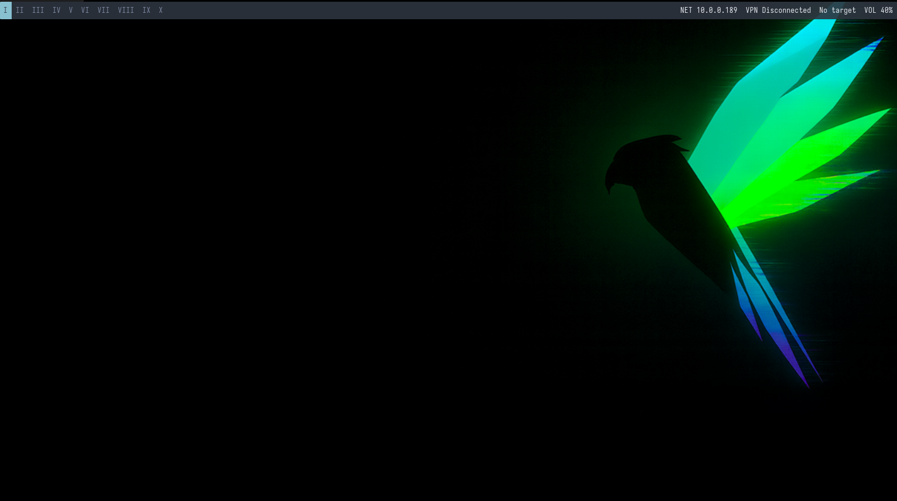

# auto-bspwm — Parrot 7 y Kali Linux

Entorno bspwm para **Parrot OS 7.x y Kali Rolling**, en **amd64 y arm64**.
También reconoce las imágenes de Parrot 7 que declaran `ID=debian` junto con
`NAME="Parrot Security"` o `NAME="Parrot Home"`; Debian genérico sigue excluido.
Instalar en una edición de escritorio con usuario normal y sudo, conexión a Internet
y repositorios oficiales funcionando. No mezclar repositorios de Kali y Parrot.

Parrot 7 usa KDE Plasma 6/Wayland por defecto. Este proyecto añade una sesión
**bspwm sobre X11**; selecciona bspwm en el gestor de acceso después de cerrar sesión.
No sustituye KDE/Xfce ni configura bspwm como compositor Wayland.

## Capturas de pantalla



Consulta la galería comentada con las cinco capturas de instalación, escritorio,
terminal, Visual Studio Code y Neovim en la
[guía Markdown](docs/shortcuts.md#13-capturas-de-instalacion-y-uso) o en la
[guía HTML](docs/shortcuts.html#13-capturas-de-instalacion-y-uso).

## Instalación

Desde el repositorio:

```bash
bash install.sh
```

Se puede ejecutar desde cualquier directorio. Opciones:

```bash
bash install.sh --help
bash install.sh --change-shell
bash install.sh --upgrade-system
bash install.sh --no-system-upgrade
bash install.sh --repo-only
bash install.sh --locked parrot7-amd64.lock.json
```

- Por defecto instala las últimas publicaciones estables de Neovim, Kitty, bat,
  lsd y Nerd Fonts (archivos Hack, Iosevka y Hermit), consultando GitHub al ejecutar.
  VS Code se descarga del canal estable oficial de Microsoft.
- bspwm, sxhkd, Polybar, Picom, Python 3, fzf y el resto de herramientas usan el
  candidato más reciente de los repositorios de la distribución tras actualizar
  sus índices. Esto **no equivale necesariamente a la última versión upstream**.
- NvChad starter y Powerlevel10k se clonan desde sus ramas predeterminadas actuales;
  se registra el commit. El instalador sincroniza los plugins de NvChad con Lazy
  y conserva el ajuste de tabulaciones/espacios del Neovim original del proyecto.
  El antiguo `Config/nvim/init.lua` queda como referencia: se aplica
  `Config/nvim/project-options.lua` sobre el starter actual para evitar rutas obsoletas.
- pwntools se instala/actualiza con pipx, aislado del Python del sistema.
  Para importar `pwn` desde tus propios scripts, crea un entorno con
  `python3 -m venv .venv`, actívalo e instala allí `pwntools`.
- `--repo-only` usa APT para Neovim, Kitty, bat y lsd y omite VS Code; las fuentes,
  NvChad, Powerlevel10k y pwntools siguen requiriendo Internet.
- El sistema se actualiza por defecto con `apt-get --no-remove full-upgrade`;
  `--upgrade-system` sigue disponible como alias explícito. Usa `--no-system-upgrade`
  para omitir esa actualización. El modo `--locked` la desactiva automáticamente
  y rechaza `--upgrade-system` explícito. Todas las operaciones APT abortan si
  requieren eliminar paquetes para proteger el escritorio original. Si APT se
  detiene por esa razón, revisa la transición de paquetes antes de continuar.
  Se usan las actualizaciones de los repositorios configurados: no se cambian
  ramas ni se migra automáticamente a una futura versión mayor no compatible.
- `--change-shell` cambia a Zsh la shell de tu usuario; Kitty ya inicia Zsh.

El instalador reemplaza las configuraciones administradas, pero antes guarda una
copia bajo `~/.local/state/auto-bspwm/backups/<ejecución>/`.
Repetirlo vuelve a consultar versiones y aplicar la configuración del proyecto:
**guarda tus ajustes personales antes de actualizar**. No es una transacción:
si falla, puede haber paquetes ya instalados y configuraciones parcialmente aplicadas.
Corrige el error indicado en el registro y vuelve a ejecutar.

Las operaciones APT se ejecutan sin interfaz interactiva y sin su pseudoterminal
para funcionar con el registro mediante `tee`. Se conservan los archivos de
configuración modificados (`--force-confold` y la opción equivalente de UCF);
revisa los posibles archivos `.dpkg-dist` después de actualizar, especialmente
los repositorios de Parrot. `needrestart` enumera servicios pendientes de reinicio;
programa un reinicio al finalizar. Los scripts propios de un paquete todavía
pueden fallar o tardar, por lo que esto no garantiza que toda actualización termine.
No ejecutes una segunda instalación ni borres los locks mientras APT/dpkg sigan activos.

Registros, versiones APT, commits y sumas SHA-256 se guardan en
`~/.local/state/auto-bspwm/`. Se verifica el digest de GitHub cuando está disponible;
si upstream no lo publica se avisa y se usa HTTPS, sin afirmar verificación
criptográfica independiente. VS Code usa HTTPS y APT valida estructura/dependencias
del paquete local, no una firma de repositorio para esa descarga.
Ante límites de API puede proporcionarse `GITHUB_TOKEN`; no se imprime en registros.

Los antiguos `*.deb`, `kitty/`, `fonts/HNF/` y las fuentes binarias de Polybar
**se retiraron del árbol de trabajo** y están excluidos por `.gitignore`.
El historial Git no se reescribió. Se usan las Nerd Fonts descargadas con sus
avisos de licencia, sin depender de Helvetica ni de archivos de licencia incierta.
No se instala Python 2, pip2 ni el fork antiguo de Picom.
Se añade exclusivamente el repositorio oficial del cliente Cloudflare One con
su clave limitada mediante `signed-by`; se respaldan los archivos previos en
el respaldo de la ejecución, bajo `system/`. No se modifica root, no se borra el repositorio
y no se reinicia automáticamente.

## Cloudflare One y Neovim

El instalador detecta hardware y añade controladores disponibles en los repositorios:
Mesa, núcleo amd64, microcódigo Intel/AMD en equipos físicos, firmware gráfico y
firmware de red para los módulos reconocidos. En VMware, VirtualBox y KVM/QEMU
selecciona herramientas del invitado. Guarda los candidatos en
`hardware-candidates.txt`; los paquetes sin candidato se notifican y se omiten.
No descarga instaladores de fabricantes ni sustituye automáticamente un controlador
NVIDIA por el propietario. En ARM conserva el núcleo específico ya instalado;
dispositivos sin controlador cargado o no reconocidos pueden requerir ajustes manuales.
Tras una actualización de núcleo/controladores puede ser necesario reiniciar.
El modo `--locked` reproduce los paquetes del lock, por lo que debe usarse en un
equipo/clon compatible con el hardware de la instalación capturada.

Cloudflare One Client (paquete `cloudflare-warp`) se instala desde el
[repositorio oficial](https://pkg.cloudflareclient.com/), usando la suite Debian
13 `trixie` para Parrot 7 y Kali actuales. APT instala su versión candidata y
la registra entre los paquetes del lock. También se incluye en `--repo-only`.
Cloudflare publica soporte para Debian; Parrot/Kali son derivados y requieren
validación propia. El instalador no inscribe el dispositivo ni ejecuta `warp-cli connect`.

Después de instalar, consulta `warp-cli --version`, `warp-cli status` y la
[guía de inscripción](https://developers.cloudflare.com/cloudflare-one/team-and-resources/devices/cloudflare-one-client/deployment/manual-deployment/).
La organización Zero Trust y sus políticas determinan el acceso. Realiza la
conexión desde la consola de la VM cuando estés preparado para cambiar sus rutas.

El script original utilizaba los plugins de **NvChad**, sin una lista adicional
de plugins propios en este repositorio. Ahora se inicializan durante la instalación;
puedes revisarlos con `:Lazy` dentro de Neovim y gestionar servidores de lenguaje
con las herramientas de la versión instalada de NvChad. Los servidores LSP y
formateadores externos pueden requerir instalación adicional. No se instala
una configuración de Neovim para root.

## Uso del escritorio

Consulta la **guía completa de atajos** en [Markdown](docs/shortcuts.md) o
[HTML sin conexión e imprimible](docs/shortcuts.html). Incluye combinaciones de
bspwm y Kitty, botones de Polybar, ejemplos y solución de problemas en VMware.
Para abrir el HTML desde la raíz del repositorio: `xdg-open docs/shortcuts.html`.

- Super + Enter: Kitty; Super + D: Rofi.
- Super + Shift + L: bloquear; Super + Alt + Q: cerrar sesión bspwm.
- Print: selección; Ctrl + Print: pantalla; Alt + Print: ventana.
- Capturas en `~/ScreenShots/`.
- `settarget IP nombre`: objetivo de la barra; `settarget` lo limpia.
- Red: interfaz de la ruta predeterminada. VPN: primera tun/tap/wg numerada.
  Para nombres diferentes, exporta `BSPWM_NETWORK_INTERFACE` y
  `BSPWM_VPN_INTERFACE` antes del inicio de la sesión.
- La batería se detecta y su módulo se omite en equipos sin batería.
- La barra predeterminada ocupa el ancho del monitor y se inicia en cada salida.
  Omite módulos secundarios en resoluciones pequeñas. Para recuperar el diseño
  anterior exporta `BSPWM_BAR_LAYOUT=classic` antes de iniciar bspwm.
- El audio usa PulseAudio o la compatibilidad PulseAudio de PipeWire.
- Al aplicar la configuración se conserva el fondo estático seleccionado en KDE,
  Xfce, GNOME, MATE o Cinnamon cuando su imagen local puede detectarse. Se respalda
  `~/.fehbg` antes de actualizarlo; una configuración existente de bspwm se conserva.
  Si hay varios fondos/monitores, se usa la primera imagen local detectada en todos
  los monitores. No se trasladan presentaciones, fondos animados ni sus plugins.
  Para elegir otro fondo ejecuta `feh --bg-fill /ruta/imagen.jpg`; se recupera en
  el próximo inicio. Si no se detecta una imagen, se mantiene el mecanismo de
  recuperación anterior (`~/.fehbg`, imagen del sistema o color de respaldo).
- Burp Suite y SecLists no forman parte de la instalación básica; instálalos
  desde los repositorios si los necesitas. El atajo de Burp requiere ese paquete.

## Versiones fijas y recuperación

Cada instalación completa guarda sus descargas con SHA-256, commits y versiones
de APT/Python en `~/.local/state/auto-bspwm/runs/<ejecución>/`. Abre Neovim para
inicializar sus plugins y prueba el escritorio. Después ejecuta:

```bash
python3 scripts/validate.py "$HOME/.local/state/auto-bspwm/runs/<ejecución>"
python3 scripts/pins.py freeze "$HOME/.local/state/auto-bspwm/runs/<ejecución>" parrot7-amd64.lock.json
```

Para reproducir esa selección en un clon de la misma imagen base:

```bash
bash install.sh --locked parrot7-amd64.lock.json
```

El lock fija los archivos descargados (incluido VS Code), sus sumas, Powerlevel10k,
NvChad starter, lazy.nvim, el lock de plugins, las versiones APT instaladas y las
dependencias Python de pwntools. Requiere la misma distribución, versión,
arquitectura y contenido del proyecto; no cae silenciosamente a `latest`.
El inventario APT incluye el escritorio de la máquina de referencia: utiliza
un clon de la misma base, no una máquina con un escritorio diferente.

La congelación requiere una ejecución completa y no sobrescribe locks existentes.
Un lock **no certifica** una prueba gráfica: se genera con `validation: not-certified`.
No hay un lock validado predefinido hasta terminar las pruebas en las VMs.
Los paquetes tienen que seguir disponibles en sus servidores; conserva una
instantánea para restauraciones duraderas. Los paquetes Python se fijan por versión,
no por hash de wheel, y los compiladores/build dependencies de PyPI pueden variar.
No incluye herramientas LSP/Mason ni configuraciones personales ajenas al proyecto.
Se trata de reproducir la selección de versiones, no de una imagen bit a bit idéntica.

Protocolo y estado real de las pruebas: [validación en VMware](docs/vm-validation.md).

1. Prueba primero en una VM con instantánea de Parrot 7 y otra de Kali Rolling.
   Las comprobaciones automatizadas no sustituyen un arranque gráfico real.
2. Mantén el escritorio original y el gestor de acceso para poder recuperar
   configuraciones desde otra sesión. Copia desde el respaldo únicamente los
   archivos que quieras restaurar; los paquetes del sistema no se revierten.
3. Conserva el lock, el código correspondiente y la instantánea de la VM validada.
   Cada nueva actualización debe pasar por una VM antes de sustituir ese conjunto.
4. Los binarios antiguos se retiraron; los `.deb` y bundles descargados no deben
   volver al repositorio. Las fuentes decorativas se sustituyeron por Nerd Fonts.
5. Algunas aplicaciones o plugins pueden necesitar dependencias adicionales
   (por ejemplo servidores LSP). Instálalas según tu lenguaje y flujo de trabajo.
6. Revisa escalado e iconos en tu hardware; el diseño clásico sigue siendo opcional
   y está pensado para pantallas amplias.
7. Usa un laboratorio aislado para herramientas heredadas que requieran Python 2.

## Validación

Si la instalación se interrumpió y los atajos o botones conservan rutas antiguas,
puedes reparar la configuración sin reinstalar paquetes:

```bash
bash scripts/apply-config.sh
```

Ejecuta como tu usuario habitual. Guarda un respaldo antes de sustituir la
configuración; después cierra sesión y selecciona **bspwm (X11)**.

En una VM VMware amd64, actualiza el núcleo, Mesa y la integración del invitado
con `bash scripts/update-vmware-drivers.sh`. Usa las versiones candidatas de los
repositorios configurados, conserva sus prioridades y no reinicia automáticamente.

```bash
bash -n install.sh
python3 -m unittest discover -s tests -v
```

CI comprueba sintaxis, selección de assets, integridad, rechazo de locks inválidos,
reproducción sin consultar latest y procesamiento de ping. No ejecuta una
instalación con privilegios ni prueba una sesión gráfica.
La compatibilidad con Parrot/Kali es el objetivo de esta refactorización y requiere
validación final en esas distribuciones; no se garantiza compatibilidad con
versiones futuras arbitrarias.

Referencias oficiales:
[Parrot 7](https://parrotsec.org/blog/2025-12-24-parrot-7.0-release-notes/),
[escritorios Kali](https://www.kali.org/docs/general-use/switching-desktop-environments/),
[Neovim](https://github.com/neovim/neovim/blob/master/INSTALL.md),
[Kitty](https://sw.kovidgoyal.net/kitty/binary/),
[VS Code Linux](https://code.visualstudio.com/docs/setup/linux).
